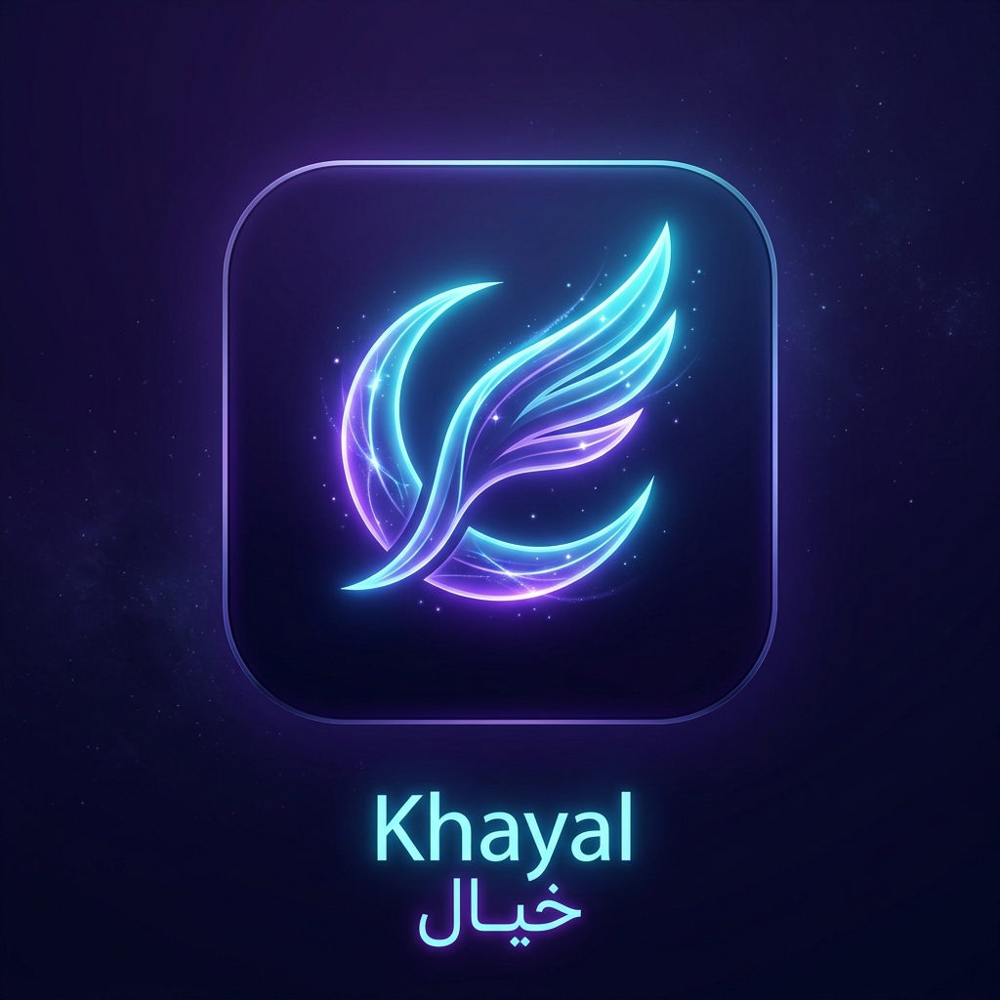

# 🌌 بوت ومنصة تواصل خيال (Khayal)

منصة تواصل متطورة وعصرية متكاملة مع **تلجرام (Telegram)** تدعم المحادثات النصية، تبادل الصور والوسائط، الملاحظات الصوتية، وميزة **المكالمات المباشرة (صوت وفيديو)** عبر تطبيق ويب مصغر (Telegram Mini App) بتقنية WebRTC، مع لوحة إدارة ذكية للمشرفين.

---

## 🎨 الهوية البصرية وشعار "خيال"

تم تصميم وتوليد الأفاتار الرسمي للمشروع بنمط نيون مستقبلي وأنيق:



> الشعار موجود في مجلد `assets/avatar.jpg` لاستخدامه كصورة شخصية للبوت في تلجرام.

---

## ✨ المميزات الرئيسية

### 1. تجربة المستخدم العادي (Client)
- **ترحيب فاخر:** رسالة ترحيب مخصصة تحمل شعار خيال وهوية بصرية عصرية.
- **تواصل متعدد الوسائط:** إرسال واستقبال نصوص، صور، مقاطع فيديو، ملفات، وملاحظات صوتية (Voice Notes).
- **📞 مكالمات خيال المباشرة (صوت وفيديو):** بضغطة زر واحدة، يفتح تطبيق ويب مصغر (Mini App) مدمج داخل شات التلجرام دون الحاجة للخروج من التطبيق للحديث مباشرة بصوت وفيديو عالي الدقة.
- **أزرار سريعة:** استعراض معلومات الحساب والدعم بضغطة زر.

### 2. لوحة تحكم وإدارة المشرف (Admin)
- **التوجيه التلقائي:** تصل رسائل المستخدمين للمشرف مع بيانات الحساب (الاسم، المعرف، والآيدي).
- **الرد السريع بضغطة زر (Reply):** يقوم المشرف فقط بعمل "Reply" على الرسالة في تلجرام، ليقوم البوت بنقل رده فوراً للمستخدم.
- **إجراء مكالمات من الإدارة:** زر مخصص أسفل كل رسالة للاتصال بالعميل فوراً.
- **🚫 حظر وإلغاء الحظر:** أوامر وأزرار لحظر المستخدمين المزعجين (`/ban` و `/unban`).
- **📢 الإذاعة الشاملة (`/broadcast`):** إرسال إعلان أو رسالة لجميع المشتركين دفعة واحدة مع تقرير بعدد المستلمين.
- **📊 إحصائيات حية (`/stats`):** عدد المستخدمين، المحظورين، الرسائل، والمكالمات.

---

## 📁 هيكل مجلدات المشروع

```
khayal-telegram-bot/
├── assets/
│   └── avatar.jpg             # الشعار الرسمي لخيال
├── static/                    # واجهة تطبيق Telegram Mini App
│   ├── index.html             # واجهة المكالمة وشاشة الانتظار
│   ├── call-ended.html        # شاشة انتهاء المكالمة
│   ├── css/
│   │   └── style.css          # تصميم النيون الداكن والزجاجي
│   ├── js/
│   │   └── app.js             # محرك WebRTC وإشارات WebSocket
│   └── images/
│       └── avatar.jpg         # أيقونة التطبيق
├── src/
│   ├── bot.py                 # منطق بوت تلجرام والردود والأوامر
│   ├── server.py              # خادم الويب وإشارات WebRTC (aiohttp)
│   ├── db.py                  # قاعدة بيانات SQLite غير المتزامنة
│   └── config.py              # تحميل إعدادات البيئة
├── main.py                    # نقطة التشغيل الرئيسية الموحدة
├── requirements.txt           # مكتبات بايثون المطلوبة
├── .env.example               # نموذج متغيرات البيئة
├── .gitignore                 # ملف استثناء الملفات الحساسة
├── Procfile                   # إعدادات التشغيل السحابي
└── render.yaml                # إعدادات النشر على منصة Render
```

---

## 🚀 خطوات التشغيل السريع (محلياً على جهازك)

### 1. استخراج التوكن ومعرف المشرف
1. ادخل إلى بوت [@BotFather](https://t.me/BotFather) في تلجرام واكتب `/newbot` لإنشاء بوت جديد باسم **خيال** واحفظ الـ **Token**.
2. لتعيين صورة البوت: أرسل `/setuserpic` واختر بوتك ثم أرسل صورة الشعار `assets/avatar.jpg`.
3. لمعرفة الـ ID الخاص بحسابك: راسل بوت [@userinfobot](https://t.me/userinfobot) وانسخ الـ `Id`.

### 2. تثبيت الحزم وتشغيل المشروع
افتح موجه الأوامر (Terminal / PowerShell) في مجلد المشروع ونفذ:

```bash
# نسخ ملف الإعدادات
copy .env.example .env

# تعديل ملف .env ووضع التوكن والآيدي
# BOT_TOKEN=123456789:ABC...
# ADMIN_IDS=987654321

# تثبيت المكتبات
pip install -r requirements.txt

# تشغيل البوت وخادم المكالمات
python main.py
```

ستظهر لك رسالة تأكيد أن خادم الويب والبوت يعملان بنجاح:
```
🚀 خادم تطبيق خيال يعمل الآن على: http://0.0.0.0:8080
🤖 جاري تشغيل بوت تلجرام للمشرفين...
✅ البوت متصل وجاهز لاستقبال الرسائل والمكالمات!
```

---

## 🌐 النشر المجاني 24/7 على السحابة (Render)

لتشغيل البوت والمكالمات طوال الوقت مجاناً دون الحاجة لترك حاسوبك يعمل:

1. **ارفع الكود إلى GitHub:**
   ```bash
   git init
   git add .
   git commit -m "الإصدار الأول لبوت ومنصة خيال"
   git branch -M main
   git remote add origin https://github.com/USERNAME/khayal-bot.git
   git push -u origin main
   ```

2. **سجّل في [Render.com](https://render.com) مجاناً.**
3. اضغط على **New +** ثم اختر **Web Service**.
4. اختر مستودع **khayal-bot** من حسابك في GitHub.
5. الإعدادات التلقائية:
   - **Environment:** `Python`
   - **Build Command:** `pip install -r requirements.txt`
   - **Start Command:** `python main.py`
6. في قسم **Environment Variables** أضف:
   - `BOT_TOKEN`: توكن البوت من BotFather
   - `ADMIN_IDS`: معرف حسابك في تلجرام
   - `BASE_URL`: رابط الخدمة الذي يوفره لك Render (مثال: `https://khayal-bot.onrender.com`)
7. اضغط **Create Web Service** وخلال دقيقة واحدة سيكون البوت والمكالمات قيد العمل!

---

## 📱 تفعيل زر الـ Mini App الدائم في تلجرام

لتظهر أيقونة تطبيق المكالمات دائماً في شات البوت:
1. في [@BotFather](https://t.me/BotFather) اكتب الأمر: `/setmenubutton`
2. اختر بوتك.
3. ضع رابط المكالمات الخاص بموقعك على Render (مثال: `https://khayal-bot.onrender.com/call`).
4. أدخل النص الذي سيظهر على الزر: `📞 مكالمة خيال`

---

## 🛡️ الأمان والخصوصية
- مكالمات WebRTC مشفرة بنظام طرف-إلى-طرف (End-to-End Encryption).
- لا يتم حفظ تسجيلات المكالمات أو الصوت على السيرفر.
- قاعدة بيانات خفيفة وسريعة لتسجيل المستخدمين والرسائل فقط.
